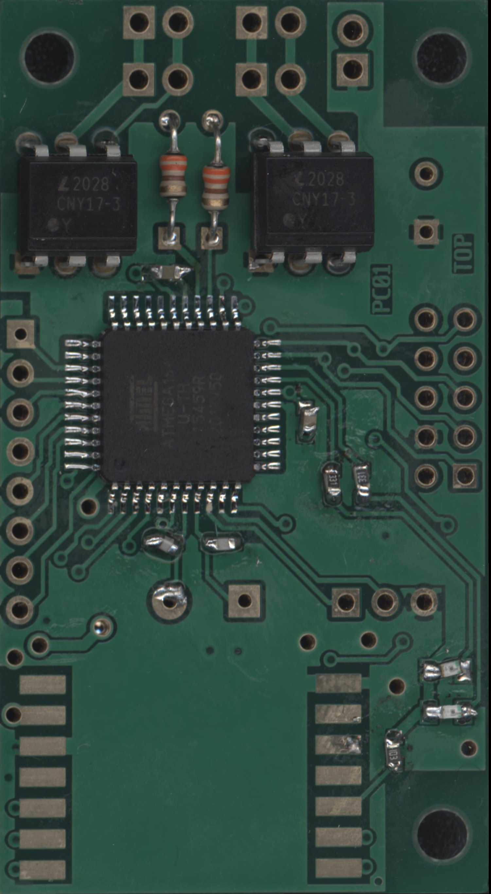

# PCB reference database

A collection of four high-resolution color scans of printed circuit boards (PCBs) for research on automated optical inspection of assembly and soldering. The scans cover both sides of 60 physical boards, with 30 board views per scan. Visible defects include displaced components, excess or insufficient solder, and solder-filled holes.



## Scan files

Each scan is an RGB TIFF image with LZW compression, distributed in a split ZIP archive.

| Archive and required parts | Extracted file | Contents | Resolution |
| --- | --- | --- | --- |
| `pcb1.zip` + `pcb1.z01`–`pcb1.z10` | `pcb1.tiff` | Bottom sides | 10200 × 15117 px |
| `pcb2.zip` + `pcb2.z01`–`pcb2.z11` | `pcb2.tiff` | Top sides | 10200 × 16062 px |
| `pcb3.zip` + `pcb3.z01`–`pcb3.z08` | `pcb3.tiff` | Bottom sides | 10200 × 16062 px |
| `pcb4.zip` + `pcb4.z01`–`pcb4.z10` | `pcb4.tiff` | Top sides | 10200 × 16062 px |

## Extraction

1. Download `pcbN.zip` and **all** matching parts (`pcbN.z01`, `pcbN.z02`, etc.). Keep them in the same directory without renaming them. If you downloaded the entire repository as a ZIP, extract the GitHub archive first.
2. Open `pcbN.zip` with a tool that supports split ZIP archives, such as 7-Zip, and extract it. The tool reads the remaining parts automatically; do not extract them individually.
3. Repeat for the other scans. Extract `gerber.zip` as a regular ZIP archive, preferably into a separate `gerber` directory.

Example using the 7-Zip command line (with `7z` available in PATH):

```sh
7z x pcb1.zip -oimages
7z x gerber.zip -ogerber
```

The four extracted images occupy approximately 1.02 GB in total. Use an image viewer that supports large TIFF files.

## Board documentation — `gerber.zip`

This archive contains reference design documentation: PDF layer views, drill files, and a component placement list.

| Files | Contents |
| --- | --- |
| `pc.bottom.pdf` | Bottom copper layer. |
| `pc.topassembly.pdf`, `pc.bottomassembly.pdf` | Assembly drawings for both board sides. |
| `pc.topmask.pdf`, `pc.bottommask.pdf` | Solder mask layers. |
| `pc.toppaste.pdf`, `pc.bottompaste.pdf` | Solder paste layers. |
| `pc.fab.pdf`, `pc.outline.pdf` | Fabrication drawing and board outline. |
| `pc.plated-drill.pdf`, `pc.unplated-drill.pdf` | Drawings of plated and unplated holes. |
| `pc.plated-drill.cnc`, `pc.unplated-drill.cnc` | Machine drill files for the respective hole types. |
| `pc.xy` | Component list: reference designator, description, value, X/Y position in mils, rotation in degrees, and mounting side. |
